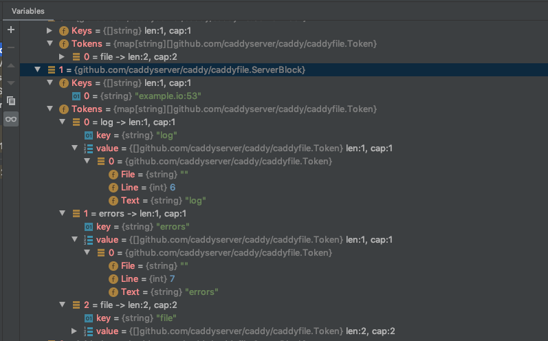

最近在看`coredns`的实现，它是基于 [caddy](https://github.com/caddyserver/caddy) 框架实现的，充分利用了 caddy 的插件功能。由于 coredns 大多数功能都是利用插件功能来实现的，所以整个项目的代码理解起来都比较简单。

#### CoreDNS 的实现

首先来看根目录下的 `Makefile` ，其中有自动生成 `core/plugin/zplugin.go` 文件和 `core/dnsserver/zdirectives.go` 文件的命令：

``` makefile
core/plugin/zplugin.go core/dnsserver/zdirectives.go: plugin.cfg
	go generate coredns.go
```

该命令可以通过 `plugin.cfg` 中列出的插件列表自动生成 zplugin.go 和 zdirectives.go 中的代码：

``` go
// generated by directives_generate.go; DO NOT EDIT

package plugin

import (
	// Include all plugins.
	_ "github.com/caddyserver/caddy/onevent"
	_ "github.com/coredns/coredns/plugin/acl"
	_ "github.com/coredns/coredns/plugin/any"
	_ "github.com/coredns/coredns/plugin/auto"
	_ "github.com/coredns/coredns/plugin/autopath"
	_ "github.com/coredns/coredns/plugin/azure"
	_ "github.com/coredns/coredns/plugin/bind"
	_ "github.com/coredns/coredns/plugin/bufsize"
	_ "github.com/coredns/coredns/plugin/cache"
	_ "github.com/coredns/coredns/plugin/cancel"
	_ "github.com/coredns/coredns/plugin/chaos"
	_ "github.com/coredns/coredns/plugin/clouddns"
	_ "github.com/coredns/coredns/plugin/debug"
	_ "github.com/coredns/coredns/plugin/dnssec"
	_ "github.com/coredns/coredns/plugin/dnstap"
	_ "github.com/coredns/coredns/plugin/erratic"
	_ "github.com/coredns/coredns/plugin/errors"
	_ "github.com/coredns/coredns/plugin/etcd"
	_ "github.com/coredns/coredns/plugin/file"
	_ "github.com/coredns/coredns/plugin/forward"
	_ "github.com/coredns/coredns/plugin/grpc"
	_ "github.com/coredns/coredns/plugin/health"
	_ "github.com/coredns/coredns/plugin/hosts"
	_ "github.com/coredns/coredns/plugin/k8s_external"
	_ "github.com/coredns/coredns/plugin/kubernetes"
	_ "github.com/coredns/coredns/plugin/loadbalance"
	_ "github.com/coredns/coredns/plugin/log"
	_ "github.com/coredns/coredns/plugin/loop"
	_ "github.com/coredns/coredns/plugin/metadata"
	_ "github.com/coredns/coredns/plugin/metrics"
	_ "github.com/coredns/coredns/plugin/nsid"
	_ "github.com/coredns/coredns/plugin/pprof"
	_ "github.com/coredns/coredns/plugin/ready"
	_ "github.com/coredns/coredns/plugin/reload"
	_ "github.com/coredns/coredns/plugin/rewrite"
	_ "github.com/coredns/coredns/plugin/root"
	_ "github.com/coredns/coredns/plugin/route53"
	_ "github.com/coredns/coredns/plugin/secondary"
	_ "github.com/coredns/coredns/plugin/sign"
	_ "github.com/coredns/coredns/plugin/template"
	_ "github.com/coredns/coredns/plugin/tls"
	_ "github.com/coredns/coredns/plugin/trace"
	_ "github.com/coredns/coredns/plugin/transfer"
	_ "github.com/coredns/coredns/plugin/whoami"
	_ "github.com/coredns/federation"
)
```

``` go
// generated by directives_generate.go; DO NOT EDIT

package dnsserver

var Directives = []string{
	"metadata",
	"cancel",
	"tls",
	"reload",
	"nsid",
	"bufsize",
	"root",
	"bind",
	"debug",
	"trace",
	"ready",
	"health",
	"pprof",
	"prometheus",
	"errors",
	"log",
	"dnstap",
	"acl",
	"any",
	"chaos",
	"loadbalance",
	"cache",
	"rewrite",
	"dnssec",
	"autopath",
	"template",
	"transfer",
	"hosts",
	"route53",
	"azure",
	"clouddns",
	"federation",
	"k8s_external",
	"kubernetes",
	"file",
	"auto",
	"secondary",
	"etcd",
	"loop",
	"forward",
	"grpc",
	"erratic",
	"whoami",
	"on",
	"sign",
}
```

这些代码的作用将在后面解释。

##### main函数

我们先看 `coredns.go` 中的 main 函数：

``` go
package main

//go:generate go run directives_generate.go
//go:generate go run owners_generate.go

import (
	"github.com/coredns/coredns/coremain"

	// 初始化所有插件
	_ "github.com/coredns/coredns/core/plugin"
)

func main() {
	coremain.Run()
}
```

想必大家都很熟悉 `_ "github.com/coredns/coredns/core/plugin"` 这一用法，目的就是想执行包 github.com/coredns/coredns/core/plugin 里的 **init** 函数。这时再回头看看 `core/plugin/zplugin.go` 中的代码，原来它又接着导入了所有在 **plugin.cfg** 中声明的插件的包，并且执行包里的 **init** 函数。这就使得所有的插件都会在 caddy 中注册自己，例如插件 file 的注册如下：


`caddy.Plugin` 结构包含了被注册的插件的基本信息,包括注册的服务类型(在CoreDNS中的服务类型是 `dns` )和请求这个插件时,这个插件该做的 Action。

```go
// Plugin is a type which holds information about a plugin.
type Plugin struct {
	// ServerType is the type of server this plugin is for.
	// Can be empty if not applicable, or if the plugin
	// can associate with any server type.
	ServerType string

	// Action is the plugin's setup function, if associated
	// with a directive in the Caddyfile.
	Action SetupFunc
}
```

caddy.RegisterPlugin方法的作用:

将指定plugin name(本示例:kubernetes)注册到服务类型为DNS的CoreDNS服务中。最终所有被注册plugin的存储结构为:

```go
// plugins is a map of server type to map of plugin name to
// Plugin. These are the "general" plugins that may or may
// not be associated with a specific server type. If it's
// applicable to multiple server types or the server type is
// irrelevant, the key is empty string (""). But all plugins
// must have a name.
plugins = make(map[string]map[string]Plugin)
```

因此，通过上面的这个过程就把CoreDNS需要的所有的plugin都注册到了 `plugins = make(map[string]map[string]Plugin)` 结构中，用于后续的使用。

注册完所有的 plugin 之后，就开始执行 main 方法。接着会去调用 `coremain.Run()` 函数，通过 `Run` 方法进入 CoreDNS 的初始化过程。需要注意的是，run.go 引入了包 `github.com/coredns/coredns/core/dnsserver` ，里面也包含了**init** 方法：

``` go
const serverType = "dns"

// Any flags defined here, need to be namespaced to the serverType other
// wise they potentially clash with other server types.
func init() {
	flag.StringVar(&Port, serverType+".port", DefaultPort, "Default port")

	caddy.RegisterServerType(serverType, caddy.ServerType{
		Directives: func() []string { return Directives },
		DefaultInput: func() caddy.Input {
			return caddy.CaddyfileInput{
				Filepath:       "Corefile",
				Contents:       []byte(".:" + Port + " {\nwhoami\nlog\n}\n"),
				ServerTypeName: serverType,
			}
		},
		NewContext: newContext,
	})
}
```

这里会向 caddy 注册一个名为 `dns` 的服务类型，并关联与这个 dns 服务类型相关的一些操作和信息，包括：

- 插件的执行顺序
- 默认配置文件
- `newContext`就是`dnsContext`对象，实现了 caddy 的 Context 接口

进入 run.go 的 init 函数，这里以注释的形式展示：

``` go
func init() {
	// 默认配置文件
	caddy.DefaultConfigFile = "Corefile"
	caddy.Quiet = true // don't show init stuff from caddy
	setVersion()	// 设置版本信息

	// 指定需要加载的配置文件
	flag.StringVar(&conf, "conf", "", "Corefile to load (default \""+caddy.DefaultConfigFile+"\")")
	flag.BoolVar(&plugins, "plugins", false, "List installed plugins")
	// 需要将PIDfile写入的地址
	flag.StringVar(&caddy.PidFile, "pidfile", "", "Path to write pid file")
	flag.BoolVar(&version, "version", false, "Show version")
	flag.BoolVar(&dnsserver.Quiet, "quiet", false, "Quiet mode (no initialization output)")

  // 与加载配置文件有关
	caddy.RegisterCaddyfileLoader("flag", caddy.LoaderFunc(confLoader))
	caddy.SetDefaultCaddyfileLoader("default", caddy.LoaderFunc(defaultLoader))

	caddy.AppName = coreName
	caddy.AppVersion = CoreVersion
}
```

做了那么多准备工作，终于要进入主方法了，我们来看 run.go 中的 Run 方法：

其他的代码我们就不关心了，直接看 :

``` go 
corefile, err := caddy.LoadCaddyfile(serverType)
```

该函数主要就是利用 coredns 注册的两个方法解析并加载配置文件到 `corefile`中，corefile 对应的结构体定义如下：

``` go
// Input represents a Caddyfile; its contents and file path
// (which should include the file name at the end of the path).
// If path does not apply (e.g. piped input) you may use
// any understandable value. The path is mainly used for logging,
// error messages, and debugging.
type Input interface {
	// Gets the Caddyfile contents
	Body() []byte

	// Gets the path to the origin file
	Path() string

	// The type of server this input is intended for
	ServerType() string
}
```

有了 `corefile` 我们就能够启动服务器啦：

``` go
instance, err := caddy.Start(corefile)
```

Start 的细节我们接下来再说，我们先把主流程看完，Start 会返回一个 instance 结构，其包含了服务的状态，并且可以用来控制和访问这些服务：

```go
// Instance contains the state of servers created as a result of
// calling Start and can be used to access or control those servers.
// It is literally an instance of a server type. Instance values
// should NOT be copied. Use *Instance for safety.
type Instance struct {
   // serverType is the name of the instance's server type
   serverType string

   // caddyfileInput is the input configuration text used for this process
   caddyfileInput Input

   // wg is used to wait for all servers to shut down
   wg *sync.WaitGroup

   // context is the context created for this instance,
   // used to coordinate the setting up of the server type
   context Context

   // servers is the list of servers with their listeners
   servers []ServerListener

   // these callbacks execute when certain events occur
   OnFirstStartup  []func() error // starting, not as part of a restart
   OnStartup       []func() error // starting, even as part of a restart
   OnRestart       []func() error // before restart commences
   OnRestartFailed []func() error // if restart failed
   OnShutdown      []func() error // stopping, even as part of a restart
   OnFinalShutdown []func() error // stopping, not as part of a restart

   // storing values on an instance is preferable to
   // global state because these will get garbage-
   // collected after in-process reloads when the
   // old instances are destroyed; use StorageMu
   // to access this value safely
   Storage   map[interface{}]interface{}
   StorageMu sync.RWMutex
}

// ServerListener pairs a server to its listener and/or packetconn.
type ServerListener struct {
	server   Server
	listener net.Listener
	packet   net.PacketConn
}

type Server interface {
	TCPServer
	UDPServer
}
```

- serverType：表示该 instance 的服务类型，在 coredns 中是 `dns`
- caddyfileInput：表示配置文件
- wg：wg 用来等待所有的服务器关闭
- context：启动服务时需要的一些上下文配置，在 coredns 中，这个 context 就是 `dnsContext`
- servers：该 instance 需要启动的服务列表，从上面的代码中可以看出，主要是 `TCP` 和 `UDP` 服务。
- Onxxx：on 开头的方法可以看成当特定事件发生时候的回调函数
- Storage：用来存储全局状态

然后主函数阻塞在instance.Wait()上面。

---

接下来，我们来看 Start 函数：

``` go
// Start starts Caddy with the given Caddyfile.
//
// This function blocks until all the servers are listening.
func Start(cdyfile Input) (*Instance, error) {
	inst := &Instance{serverType: cdyfile.ServerType(), wg: new(sync.WaitGroup), Storage: make(map[interface{}]interface{})}
	err := startWithListenerFds(cdyfile, inst, nil)
	if err != nil {
		return inst, err
	}
	signalSuccessToParent()
	if pidErr := writePidFile(); pidErr != nil {
		log.Printf("[ERROR] Could not write pidfile: %v", pidErr)
	}

	// Execute instantiation events
	EmitEvent(InstanceStartupEvent, inst)

	return inst, nil
}
```

可以看见，他首先初始化了一个 Instance 结构体，在该函数中主要调用三个函数分别是:

- startWithListenerFds: 用于解析 Corefile 配置文件及校验指令执行的是否正确，并启动CoreDNS服务。
- signalSuccessToParent: 向父进程报告服务启动状态。
- writePidFile: 将启动服务的进程 ID(PID) 写入到指定的文件。

从上面的解释中即可知道 startWithListenerFds 是最为核心的函数调用了，接下来直接详细的分析startWithListenerFds 函数。在该函数中首先会调用

``` go
err = ValidateAndExecuteDirectives(cdyfile, inst, false)
```

从名字就可以看出这个函数的主要功能就是验证和执行指令（也就是插件），首先他会调用

``` go
sblocks, err := loadServerBlocks(stypeName, cdyfile.Path(), bytes.NewReader(cdyfile.Body()))
```

来解析配置文件中的内容，如果配置文件中出现了coredns无法识别的插件，那么就会直接返回错误，程序终止，如果解析成功，那么就会把配置文件中的内容映射到 ServerBlock 结构体中：

```go
// ServerBlock associates any number of keys (usually addresses
// of some sort) with tokens (grouped by directive name).
type ServerBlock struct {
	Keys   []string
	Tokens map[string][]Token
}
```

其中，keys 用来存储配置文件中 Zone 的相关数据，而 Tokens 则用来存储该 server 中的插件的相关信息，其中 Tokens 的 key 是 plugin name , []Token 存储的是该 plugin 在 Corefile 中的位置，便于后续的解析操作。可能不太好理解，但是对应配置文件就非常好理解啦：

```Corefile
// coredns.io:5300 为 keys
coredns.io:5300 {
    file db.coredns.io
}

example.io:53 {
    log
    errors
    file db.example.io
}

example.net:53 {
    file db.example.net
}

.:53 {
    kubernetes
    proxy . 8.8.8.8
    log
    errors
    cache
}
```



如上图，对应的 zone 就是 `example.io:53`，其中包含三个插件，所以 Tokens 有三个元素，其中 file 插件对应的value 的长度为 2。

接着，会调用 

``` go
inst.context = stype.NewContext(inst)
```

这里的 stype.NewContext 就是在初始化阶段赋值给他的 `newContext`函数：

``` go
func newContext(i *caddy.Instance) caddy.Context {
	return &dnsContext{keysToConfigs: make(map[string]*Config)}
}

// dnsContext
// 实现了caddy.Context接口
type dnsContext struct {
	keysToConfigs map[string]*Config

	// configs is the master list of all site configs.
	// configs是所有站点配置的主列表。
	configs []*Config
}

Context interface {
	// Called after the Caddyfile is parsed into server
	// blocks but before the directives are executed,
	// this method gives you an opportunity to inspect
	// the server blocks and prepare for the execution
	// of directives. Return the server blocks (which
	// you may modify, if desired) and an error, if any.
	// The first argument is the name or path to the
	// configuration file (Caddyfile).
	//
	// This function can be a no-op and simply return its
	// input if there is nothing to do here.
	InspectServerBlocks(string, []caddyfile.ServerBlock) ([]caddyfile.ServerBlock, error)

	// This is what Caddy calls to make server instances.
	// By this time, all directives have been executed and,
	// presumably, the context has enough state to produce
	// server instances for Caddy to start.
	MakeServers() ([]Server, error)
}
```

所以，创建一个实现了 `caddy.Context` 接口的 `dnsContext`结构体，并赋值给 `instance.Context`，然后调用 Context 的接口方法 InspectServerBlocks ，这个函数会在解析完Corefile文件之后，执行Corefile中的指令之前会被调用，用于进一步的对 sblocks 进行检查并进行进一步的参数完善。：

``` go
sblocks, err = inst.context.InspectServerBlocks(cdyfile.Path(), sblocks)
```

等上面的准备工作准备完成之后，会调用`executeDirectives`去遍历所有的指令`directives`,并执行每个 sblocks 中的指令,并设置相应的 Controller 去执行相关 plugin 的 action 动作, 每个 serverblock 中的插件的 setup 只执行一次:

```go
func executeDirectives(inst *Instance, filename string,
   directives []string, sblocks []caddyfile.ServerBlock, justValidate bool) error {
   // map of server block ID to map of directive name to whatever.
   storages := make(map[int]map[string]interface{})

   // It is crucial that directives are executed in the proper order.
   // We loop with the directives on the outer loop so we execute
   // a directive for all server blocks before going to the next directive.
   // This is important mainly due to the parsing callbacks (below).
   for _, dir := range directives {
      for i, sb := range sblocks {
         var once sync.Once
         if _, ok := storages[i]; !ok {
            storages[i] = make(map[string]interface{})
         }

         for j, key := range sb.Keys {
            // Execute directive if it is in the server block
            if tokens, ok := sb.Tokens[dir]; ok {
               controller := &Controller{
                  instance:  inst,
                  Key:       key,
                  Dispenser: caddyfile.NewDispenserTokens(filename, tokens),
                  OncePerServerBlock: func(f func() error) error {
                     var err error
                     once.Do(func() {
                        err = f()
                     })
                     return err
                  },
                  ServerBlockIndex:    i,
                  ServerBlockKeyIndex: j,
                  ServerBlockKeys:     sb.Keys,
                  ServerBlockStorage:  storages[i][dir],
               }

               setup, err := DirectiveAction(inst.serverType, dir)
               if err != nil {
                  return err
               }

               err = setup(controller)
               if err != nil {
                  return err
               }

               storages[i][dir] = controller.ServerBlockStorage // persist for this server block
            }
         }
      }

      if !justValidate {
         // See if there are any callbacks to execute after this directive
         if allCallbacks, ok := parsingCallbacks[inst.serverType]; ok {
            callbacks := allCallbacks[dir]
            for _, callback := range callbacks {
               if err := callback(inst.context); err != nil {
                  return err
               }
            }
         }
      }
   }

   return nil
}
```

执行完了 `ValidateAndExecuteDirectives` 函数，就意味着所有的插件都已经准备完毕，接着调用 `MakeServers`返回一个服务器列表：

```go
slist, err := inst.context.MakeServers()
```

我们深入进去会发现，这个方法其实非常简单：

```go
// MakeServers uses the newly-created siteConfigs to create and return a list of server instances.
func (h *dnsContext) MakeServers() ([]caddy.Server, error) {

   // Now that all Keys and Directives are parsed and initialized
   // lets verify that there is no overlap on the zones and addresses to listen for
   errValid := h.validateZonesAndListeningAddresses()
   if errValid != nil {
      return nil, errValid
   }

   // we must map (group) each config to a bind address
   groups, err := groupConfigsByListenAddr(h.configs)
   if err != nil {
      return nil, err
   }
   // then we create a server for each group
   var servers []caddy.Server
   for addr, group := range groups {
      // switch on addr
      switch tr, _ := parse.Transport(addr); tr {
      case transport.DNS:
         s, err := NewServer(addr, group)
         if err != nil {
            return nil, err
         }
         servers = append(servers, s)

      case transport.TLS:
         s, err := NewServerTLS(addr, group)
         if err != nil {
            return nil, err
         }
         servers = append(servers, s)

      case transport.GRPC:
         s, err := NewServergRPC(addr, group)
         if err != nil {
            return nil, err
         }
         servers = append(servers, s)

      case transport.HTTPS:
         s, err := NewServerHTTPS(addr, group)
         if err != nil {
            return nil, err
         }
         servers = append(servers, s)
      }

   }

   return servers, nil
}
```

首先，它验证是否有端口冲突（同一zone，并且同一端口才算冲突），然后再根据 dnsContext 中的 `configs`生成不同的 `group`，根据监听的端口不同被分到不同的 group，最后返回一个 `groups`，之后遍历该 `groups`, 然后根据不同的 transport 去启动相应的服务，当前 CoreDNS 支持4种类型的 transport，默认情况下都是 DNS 。

但是，无论哪种 transport 最终都会调用 `NewServer`：

```go
func NewServer(addr string, group []*Config) (*Server, error) {

   s := &Server{
      Addr:         addr,
      zones:        make(map[string]*Config),
      graceTimeout: 5 * time.Second,
   }
   for _, site := range group {
      
      s.zones[site.Zone] = site

      // compile custom plugin for everything
      var stack plugin.Handler
      for i := len(site.Plugin) - 1; i >= 0; i-- {
         stack = site.Plugin[i](stack)

         // register the *handler* also
         site.registerHandler(stack)

         if s.trace == nil && stack.Name() == "trace" {
            // we have to stash away the plugin, not the
            // Tracer object, because the Tracer won't be initialized yet
            if t, ok := stack.(trace.Trace); ok {
               s.trace = t
            }
         }
         // Unblock CH class queries when any of these plugins are loaded.
         if _, ok := EnableChaos[stack.Name()]; ok {
            s.classChaos = true
         }
      }
      site.pluginChain = stack
   }

   return s, nil
}
```

由于代码过长，只看重点部分，先创建了一个 `Server` 变量，然后遍历 group ，并将每个 site 对应的 plugins 以栈的形式组成  `pluginChain`，最后返回。

上面只是make了CoreDNS需要启动的`Server`结构,但是真正的服务进程到现在这个阶段还没有真正的启动。当所有的 plugin 需要的准备工作都处理完成之后，就调用`startServers`来启动CoreDNS服务,`startServers`函数的定义如下:

```go
func startServers(serverList []Server, inst *Instance, restartFds map[string]restartTriple) error {
   for _, s := range serverList {
      var (
         ln  net.Listener
         pc  net.PacketConn
         err error
      )

 			......
      ......
      if ln == nil {
         ln, err = s.Listen()
         if err != nil {
            return fmt.Errorf("Listen: %v", err)
         }
      }
      if pc == nil {
         pc, err = s.ListenPacket()
         if err != nil {
            return fmt.Errorf("ListenPacket: %v", err)
         }
      }

      inst.servers = append(inst.servers, ServerListener{server: s, listener: ln, packet: pc})
   }

   for _, s := range inst.servers {
      inst.wg.Add(2)
      stopWg.Add(2)
      func(s Server, ln net.Listener, pc net.PacketConn, inst *Instance) {
         go func() {
            defer func() {
               inst.wg.Done()
               stopWg.Done()
            }()
            errChan <- s.Serve(ln)
         }()

         go func() {
            defer func() {
               inst.wg.Done()
               stopWg.Done()
            }()
            errChan <- s.ServePacket(pc)
         }()
      }(s.server, s.listener, s.packet, inst)
   }

   // Log errors that may be returned from Serve() calls,
   // these errors should only be occurring in the server loop.
   go func() {
      for {
         select {
         case err := <-errChan:
            if err != nil {
               if !strings.Contains(err.Error(), "use of closed network connection") {
                  // this error is normal when closing the listener; see https://github.com/golang/go/issues/4373
                  log.Println(err)
               }
            }
         case <-stopChan:
            return
         }
      }
   }()

   go func() {
      stopWg.Wait()
      stopChan <- struct{}{}
   }()

   return nil
}


// Serve starts the server with an existing listener. It blocks until the server stops.
// This implements caddy.TCPServer interface.
func (s *Server) Serve(l net.Listener) error {
	s.m.Lock()
	s.server[tcp] = &dns.Server{Listener: l, Net: "tcp", Handler: dns.HandlerFunc(func(w dns.ResponseWriter, r *dns.Msg) {
		ctx := context.WithValue(context.Background(), Key{}, s)
		s.ServeDNS(ctx, w, r)
	})}
	s.m.Unlock()

	return s.server[tcp].ActivateAndServe()
}

// ServePacket starts the server with an existing packetconn. It blocks until the server stops.
// This implements caddy.UDPServer interface.
func (s *Server) ServePacket(p net.PacketConn) error {
	s.m.Lock()
	s.server[udp] = &dns.Server{PacketConn: p, Net: "udp", Handler: dns.HandlerFunc(func(w dns.ResponseWriter, r *dns.Msg) {
		ctx := context.WithValue(context.Background(), Key{}, s)
		s.ServeDNS(ctx, w, r)
	})}
	s.m.Unlock()

	return s.server[udp].ActivateAndServe()
}
```

同样省略部分代码，首先遍历 serverList ，并且生成 `inst.servers` 列表，然后再遍历 `inst.servers` 列表，启动协程分别监听 TCP 和 UDP，并且分别调用各自内部的 ServeDNS 来进行服务。

走到这里，启动流程算是彻底走完了。

##### 总结

CoreDNS 代码的结构非常清晰，通过初始化时加载自定义的插件顺序，依次注入到 caddy 中去，并在执行的时候，按照定义的插件顺序依次执行，形成一个链式的调用结构。CoreDNS 同样还支持多种协议供使用者选择，这是一个非常好的实现。

**参考**：

1. [CoreDNS源码分析](https://xigang.github.io/2019/08/25/coredns/)
2. [CoreDNS源码分析](https://juejin.im/post/5d11d262e51d4556f76e80ca)