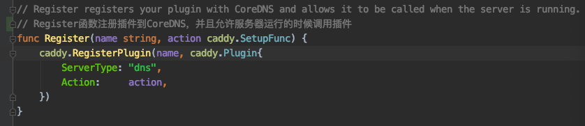

最近在看`coredns`的实现，它是基于 [caddy](https://github.com/caddyserver/caddy) 框架实现的，充分利用了 caddy 的插件功能。由于 coredns 大多数功能都是利用插件功能来实现的，所以整个项目的代码理解起来都比较简单。

#### CoreDNS 的实现

首先来看根目录下的 `Makefile` ，其中有自动生成 `core/plugin/zplugin.go` 文件和 `core/dnsserver/zdirectives.go` 文件的命令：

``` makefile
core/plugin/zplugin.go core/dnsserver/zdirectives.go: plugin.cfg
	go generate coredns.go
```

该命令可以通过 `plugin.cfg` 中列出的插件列表自动生成 zplugin.go 和 zdirectives.go 中的代码：

``` go
// generated by directives_generate.go; DO NOT EDIT

package plugin

import (
	// Include all plugins.
	_ "github.com/caddyserver/caddy/onevent"
	_ "github.com/coredns/coredns/plugin/acl"
	_ "github.com/coredns/coredns/plugin/any"
	_ "github.com/coredns/coredns/plugin/auto"
	_ "github.com/coredns/coredns/plugin/autopath"
	_ "github.com/coredns/coredns/plugin/azure"
	_ "github.com/coredns/coredns/plugin/bind"
	_ "github.com/coredns/coredns/plugin/bufsize"
	_ "github.com/coredns/coredns/plugin/cache"
	_ "github.com/coredns/coredns/plugin/cancel"
	_ "github.com/coredns/coredns/plugin/chaos"
	_ "github.com/coredns/coredns/plugin/clouddns"
	_ "github.com/coredns/coredns/plugin/debug"
	_ "github.com/coredns/coredns/plugin/dnssec"
	_ "github.com/coredns/coredns/plugin/dnstap"
	_ "github.com/coredns/coredns/plugin/erratic"
	_ "github.com/coredns/coredns/plugin/errors"
	_ "github.com/coredns/coredns/plugin/etcd"
	_ "github.com/coredns/coredns/plugin/file"
	_ "github.com/coredns/coredns/plugin/forward"
	_ "github.com/coredns/coredns/plugin/grpc"
	_ "github.com/coredns/coredns/plugin/health"
	_ "github.com/coredns/coredns/plugin/hosts"
	_ "github.com/coredns/coredns/plugin/k8s_external"
	_ "github.com/coredns/coredns/plugin/kubernetes"
	_ "github.com/coredns/coredns/plugin/loadbalance"
	_ "github.com/coredns/coredns/plugin/log"
	_ "github.com/coredns/coredns/plugin/loop"
	_ "github.com/coredns/coredns/plugin/metadata"
	_ "github.com/coredns/coredns/plugin/metrics"
	_ "github.com/coredns/coredns/plugin/nsid"
	_ "github.com/coredns/coredns/plugin/pprof"
	_ "github.com/coredns/coredns/plugin/ready"
	_ "github.com/coredns/coredns/plugin/reload"
	_ "github.com/coredns/coredns/plugin/rewrite"
	_ "github.com/coredns/coredns/plugin/root"
	_ "github.com/coredns/coredns/plugin/route53"
	_ "github.com/coredns/coredns/plugin/secondary"
	_ "github.com/coredns/coredns/plugin/sign"
	_ "github.com/coredns/coredns/plugin/template"
	_ "github.com/coredns/coredns/plugin/tls"
	_ "github.com/coredns/coredns/plugin/trace"
	_ "github.com/coredns/coredns/plugin/transfer"
	_ "github.com/coredns/coredns/plugin/whoami"
	_ "github.com/coredns/federation"
)
```

``` go
// generated by directives_generate.go; DO NOT EDIT

package dnsserver

var Directives = []string{
	"metadata",
	"cancel",
	"tls",
	"reload",
	"nsid",
	"bufsize",
	"root",
	"bind",
	"debug",
	"trace",
	"ready",
	"health",
	"pprof",
	"prometheus",
	"errors",
	"log",
	"dnstap",
	"acl",
	"any",
	"chaos",
	"loadbalance",
	"cache",
	"rewrite",
	"dnssec",
	"autopath",
	"template",
	"transfer",
	"hosts",
	"route53",
	"azure",
	"clouddns",
	"federation",
	"k8s_external",
	"kubernetes",
	"file",
	"auto",
	"secondary",
	"etcd",
	"loop",
	"forward",
	"grpc",
	"erratic",
	"whoami",
	"on",
	"sign",
}
```

这些代码的作用将在后面解释。

##### main函数

我们先看 `coredns.go` 中的 main 函数：

``` go
package main

//go:generate go run directives_generate.go
//go:generate go run owners_generate.go

import (
	"github.com/coredns/coredns/coremain"

	// 初始化所有插件
	_ "github.com/coredns/coredns/core/plugin"
)

func main() {
	coremain.Run()
}
```

想必大家都很熟悉 `_ "github.com/coredns/coredns/core/plugin"` 这一用法，目的就是想执行包 github.com/coredns/coredns/core/plugin 里的 **init** 函数。这时再回头看看 `core/plugin/zplugin.go` 中的代码，原来它又接着导入了所有在 **plugin.cfg** 中声明的插件的包，并且执行包里的 **init** 函数。这就使得所有的插件都会在 caddy 中注册自己，例如插件 file 的注册如下：




`caddy.Plugin` 结构包含了被注册的插件的基本信息,包括注册的服务类型(在CoreDNS中的服务类型是 `dns` )和请求这个插件时,这个插件该做的 Action。

```go
// Plugin is a type which holds information about a plugin.
type Plugin struct {
	// ServerType is the type of server this plugin is for.
	// Can be empty if not applicable, or if the plugin
	// can associate with any server type.
	ServerType string

	// Action is the plugin's setup function, if associated
	// with a directive in the Caddyfile.
	Action SetupFunc
}
```

caddy.RegisterPlugin方法的作用:

将指定plugin name(本示例:kubernetes)注册到服务类型为DNS的CoreDNS服务中。最终所有被注册plugin的存储结构为:

```go
// plugins is a map of server type to map of plugin name to
// Plugin. These are the "general" plugins that may or may
// not be associated with a specific server type. If it's
// applicable to multiple server types or the server type is
// irrelevant, the key is empty string (""). But all plugins
// must have a name.
plugins = make(map[string]map[string]Plugin)
```

因此，通过上面的这个过程就把CoreDNS需要的所有的plugin都注册到了 `plugins = make(map[string]map[string]Plugin)` 结构中，用于后续的使用。

注册完所有的 plugin 之后，就开始执行 main 方法。接着会去调用 `coremain.Run()` 函数，通过 `Run` 方法进入 CoreDNS 的初始化过程。需要注意的是，run.go 引入了包 `github.com/coredns/coredns/core/dnsserver` ，里面也包含了**init** 方法：

``` go
const serverType = "dns"

// Any flags defined here, need to be namespaced to the serverType other
// wise they potentially clash with other server types.
func init() {
	flag.StringVar(&Port, serverType+".port", DefaultPort, "Default port")

	caddy.RegisterServerType(serverType, caddy.ServerType{
		Directives: func() []string { return Directives },
		DefaultInput: func() caddy.Input {
			return caddy.CaddyfileInput{
				Filepath:       "Corefile",
				Contents:       []byte(".:" + Port + " {\nwhoami\nlog\n}\n"),
				ServerTypeName: serverType,
			}
		},
		NewContext: newContext,
	})
}
```

这里会向 caddy 注册一个名为 `dns` 的服务类型，并关联与这个 dns 服务类型相关的一些操作和信息，包括：

- 所有的插件信息，以及顺序