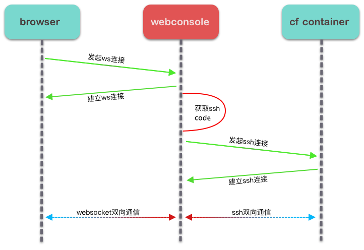

### 1. 调研

前端：了解到有一个非常优秀的开源web终端库： **xterm.js** , 使用起来也比较简单。

后端：使用 go 语言实现，因为 go 语言拥有许多优秀的开源ssh库，能够满足我们的需求。

难点：

	1. 如何与 cf(cloud foundry) 进行交互得到 `ssh code` ？
 	2. 如何把 ssh 命令行转换成 websocket 通讯, 并输出到 xterm.js 中？
 	3. 如何控制访问权限？


### 2. 原理


​	1. 浏览器向服务器发起 websocket 请求

​	2. 服务器通过 ssh 连接到 cf 容器

​	3. 连接建立，服务器负责转发消息

在后端和浏览器之间建立websocket连接后，将用户在浏览器中输入的命令通过 websocket 协议发送到后端，后端使用 ssh 协议将命令输入到容器ssh进程的 stdin，命令执行后，再从 stdout 中读取输出，通过websocket协议返回浏览器显示给用户，达到交互的目的。


### 3. 问题解决以及服务端实现

在前两个步骤中，我已经通过分析把原理和难点梳理清楚了，目前就需要着手解决这些问题。

#### 3.1 如何获取 ssh code

cf 有一个自带的命令 `cf ssh-code` 能够获取连接到容器用的 `ssh code`，但是我并没有在 cf 开源的 go 语言客户端 `cfclient` 中发现相关的 API，所以我去查看了 cf cli 的源码，并在里面发现了 **cc** 暴露出来的接口，有了这个接口之后，就能够通过 http 请求的方式获取 `ssh-code`。由于 `cfclient` 中并没有相关的代码，所以不得不自己实现一些方来获取 `ssh-code`, 于是这个问题解决了。

#### 3.2 如何将 websocket 和 ssh 这两个协议的消息进行转换

**连接建立**：



``` go
func WS(c *gin.Context) {
	// 初始化websocket连接
	upgrader := websocket.Upgrader{
		ReadBufferSize:  1024,
		WriteBufferSize: 1024,
	}
	ws, err := upgrader.Upgrade(c.Writer, c.Request, nil)
	defer ws.Close()
  
	// 初始化ssh连接
	cl, _ := c.Get("claims")
	s, _ := c.Get("session")
	claims := cl.(*utils.Claims)
	session := s.(*utils.Session)

	sshShell := utils.SSHShellSession{
		Node: utils.Node{
			Host: claims.Host,
			Port: claims.Port,
		},
	}

	var wsBuff WebSocketBufferWriter
	sshShell.StdoutPipe = &wsBuff
	err = sshConn.Connect(username, password)
	defer sshConn.Close()
	defer wsBuff.Flush(websocket.TextMessage, ws)
	......
  ......
}
```


**连接保持：**

``` go
func WS(c *gin.Context) {
  ......
  ......
	done := make(chan bool, 3)
	setDone := func() { done <- true }

	// 数据转换：websocket ----> SSH
	writeMessageToSSHServer := func(wc io.WriteCloser) {
		defer setDone()
		for {
			// 从websocket读取数据
			msgType, p, err := ws.ReadMessage()

			if err = DispatchMessage(sshShell.Session, msgType, p, wc); err != nil {
				log.Println("Error: error write data to ssh server:", err)
				return
			}
		}
	}

	stopper := make(chan bool)
	// 数据转换：SSH ----> websocket
	writeBufferToWebSocket := func() {
		defer setDone()
		tick := time.NewTicker(time.Millisecond * time.Duration(utils.Config.SSH.BufferCheckerCycleTime))
		defer tick.Stop()
		for {
			select {
			case <-tick.C:
				if err := wsBuff.Flush(websocket.TextMessage, ws); err != nil {
					log.Println("Error: error sending data via webSocket:", err)
					return
				}
			case <-stopper:
				return
			}
		}
	}

	go writeMessageToSSHServer(sshShell.StdinPipe)
	go writeBufferToWebSocket()
	go func() {
		defer setDone()
		if err := sshShell.Session.Wait(); err != nil{
			log.Println("ssh exist from server", err)
		}
	}()

	<-done
	stopper <- true 
	log.Println("Info: websocket finished!")
}
```


**控制访问权限**：

利用 cf 自带的权限认证机制实现。